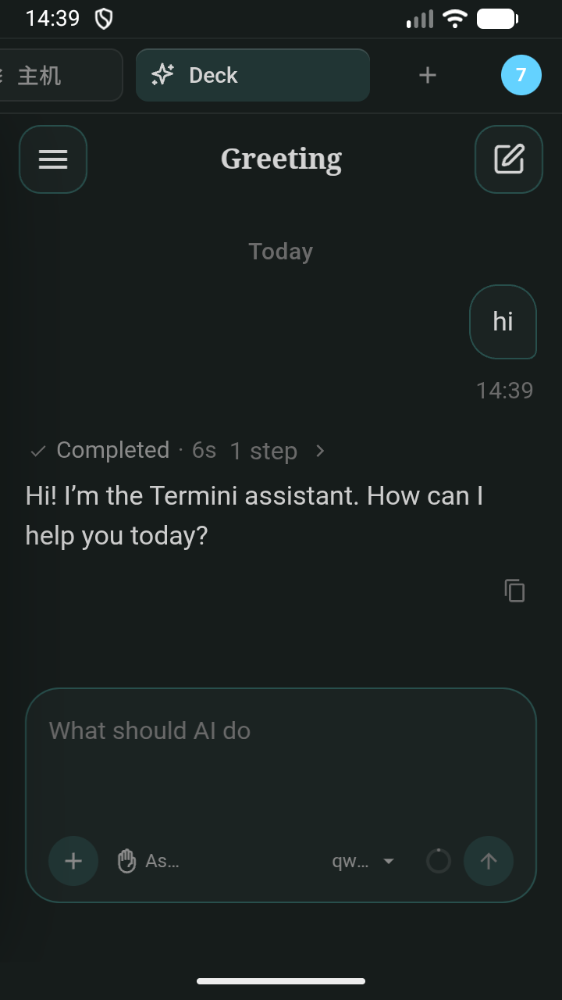
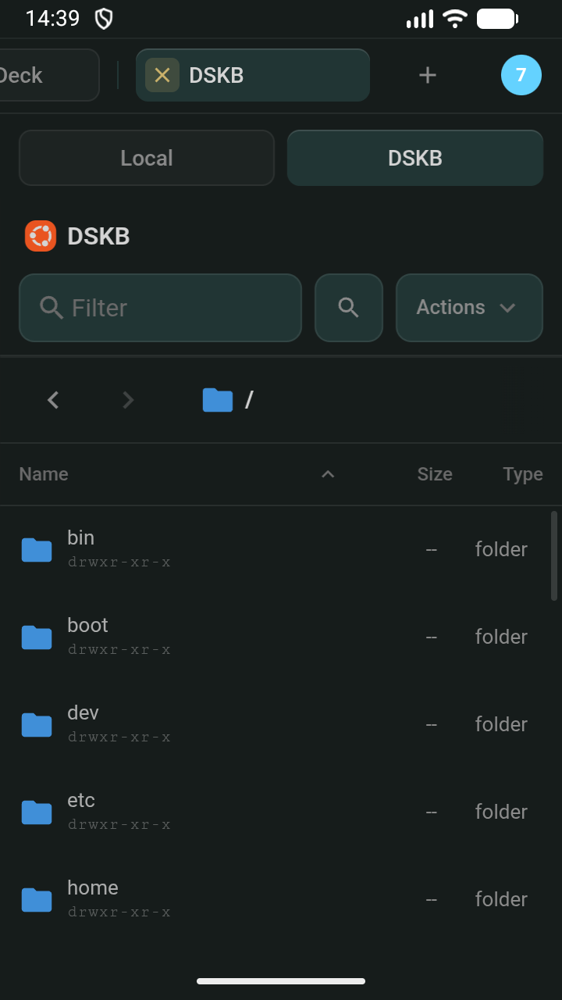
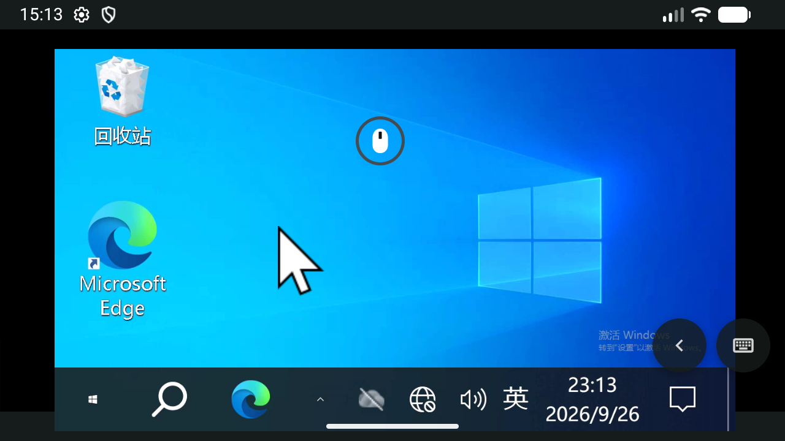
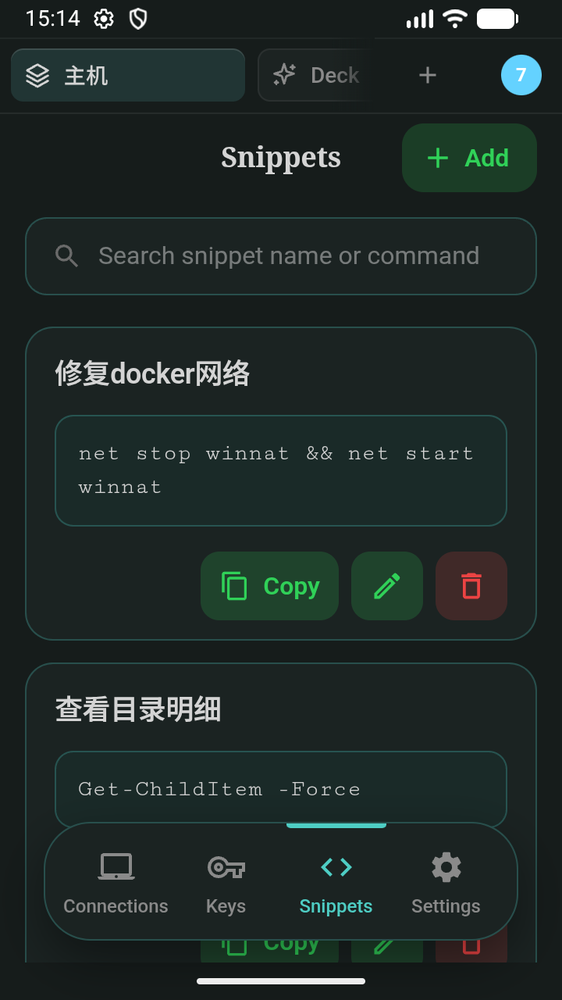
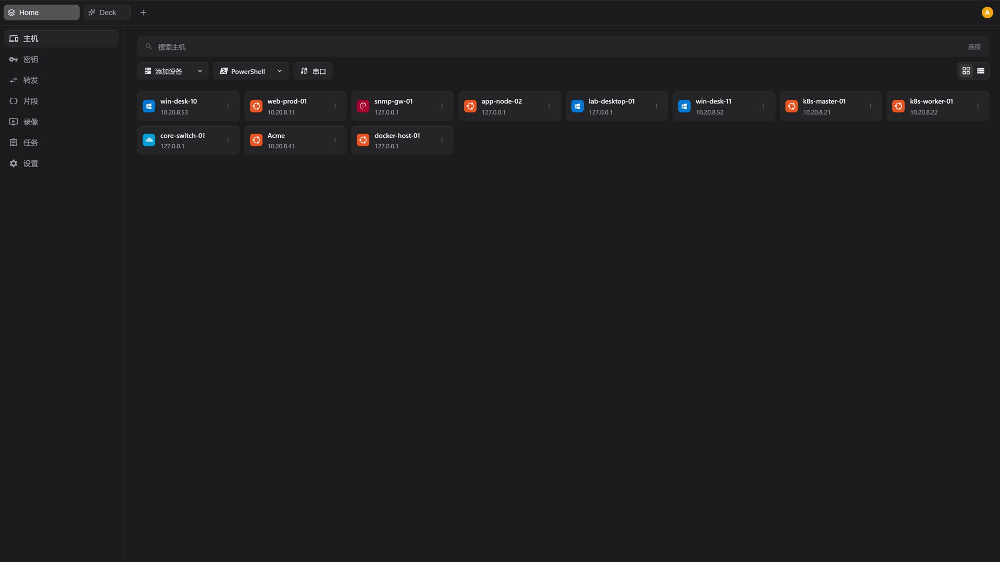
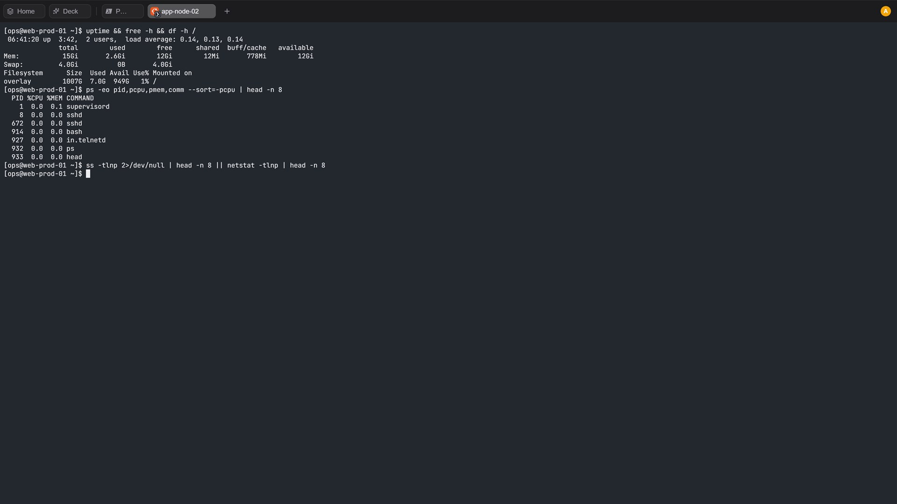
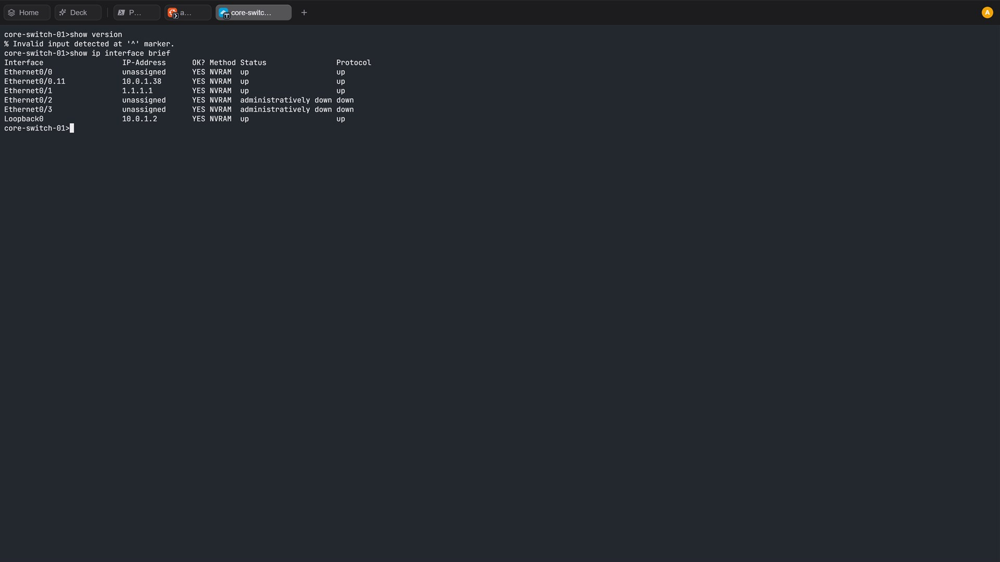
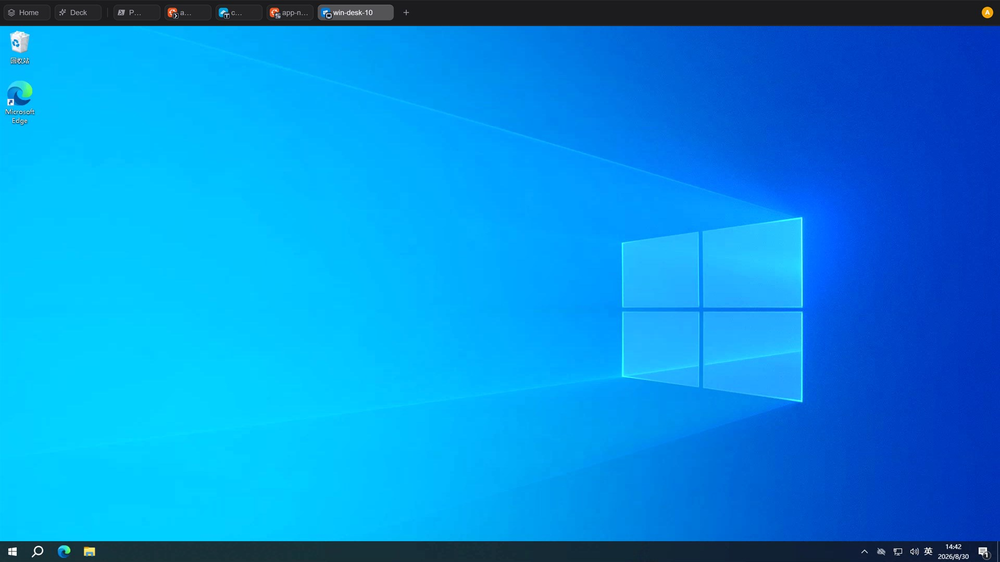
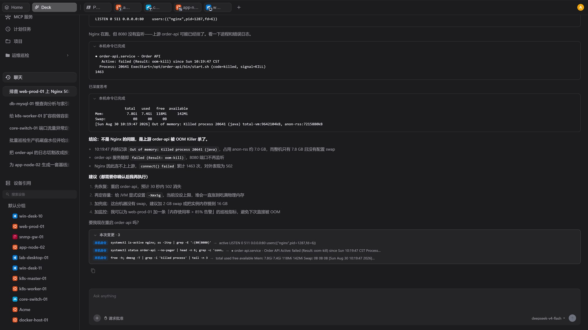

# Termini

**English** | [中文](#termini-中文)

AI ops workspace for SSH, Telnet, RDP and SFTP.

Connect protocols in one place. The agent runs on real devices; risky actions require approval first; everything is logged; reports can be generated.

## Highlights

- **Approval boundary** — read-only actions pass automatically; similar commands are approved once by prefix; steps that change a system still wait for confirmation
- **Deliverables** — inspection and troubleshooting results as Word, PDF or Excel
- **Host inventory** — hosts, identities and permissions in one place
- **In-session file transfer** — local and remote side by side in the current workspace
- **RDP in the same workspace** — alongside SSH, Telnet and SFTP
- **Session-aware command hints** — suggestions from the current session and device dialect
- **Inspection to routine** — you decide whether new observation points join the routine

## Screenshots

### Android

AI Deck chat

In-session SFTP file browser

RDP desktop in the same workspace

Reusable command snippets

### Windows

Host inventory dashboard

SSH session terminal

Network device CLI session

Windows RDP tab

AI troubleshooting on real devices

## Download / Docs / Pricing / Sign in

All product pages: [https://terminiapp.com/](https://terminiapp.com/)

## Platforms

| Platform | Status |
| --- | --- |
| iOS | Available |
| macOS | Available |
| Windows | Available |
| Linux | Coming soon — packages will be published on this repository's Releases |

## This repository

This repository does **not** include source code. It is for product introduction and feedback only.

- Open an [Issue](https://github.com/chengpengvb/termini-app/issues) for bugs or feature requests
- Pull requests that treat this as an open-source codebase are not accepted

## Privacy / Terms

- [Privacy Policy](https://terminiapp.com/en/privacy)
- [Terms of Service](https://terminiapp.com/en/terms)

---

# Termini（中文）

[English](#termini) | **中文**

面向 SSH、Telnet、RDP、SFTP 的 AI 运维工作区。

在一处连接上述协议；agent 在真实设备上执行；风险操作先批准；有日志；能出报告。

## 要点

- **批准边界** — 只读自动过；相似命令按前缀批一次；改系统仍要确认
- **交付物** — 巡检与排障结果可输出为 Word / PDF / Excel
- **主机清单** — 主机、身份与权限集中管理
- **会话内传文件** — 本地与远端同在当前工作区
- **RDP 同一工作区** — 与 SSH、Telnet、SFTP 并列
- **按当前会话给命令提示** — 结合当前会话与设备命令方言
- **巡检是否纳入例行** — 由你决定

## 截图

### Android

AI Deck 对话

会话内 SFTP 文件浏览

同一工作区内的 RDP

命令片段

### Windows

主机清单

SSH 会话终端

网络设备 CLI 会话

Windows RDP 标签页

在真实设备上做 AI 排障

## 下载 / 文档 / 定价 / 登录

产品站统一入口：[https://terminiapp.com/](https://terminiapp.com/)

## 平台

| 平台 | 状态 |
| --- | --- |
| iOS | 已上架 |
| macOS | 已上架 |
| Windows | 已上架 |
| Linux | 即将提供 — 安装包将发布在本库 Releases |

## 关于本库

本库**不包含源代码**，仅用于产品介绍与反馈。

- 请通过 [Issue](https://github.com/chengpengvb/termini-app/issues) 提交 Bug 或功能建议
- 不接受按开源项目提交的 PR

## 隐私 / 条款

- [Privacy Policy](https://terminiapp.com/en/privacy)
- [Terms of Service](https://terminiapp.com/en/terms)
